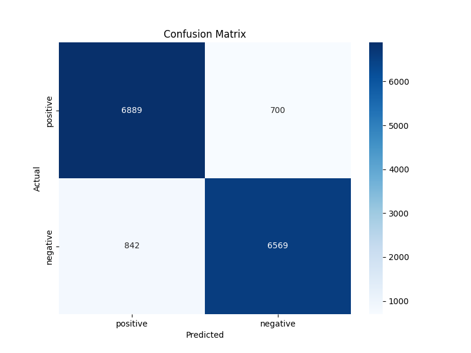
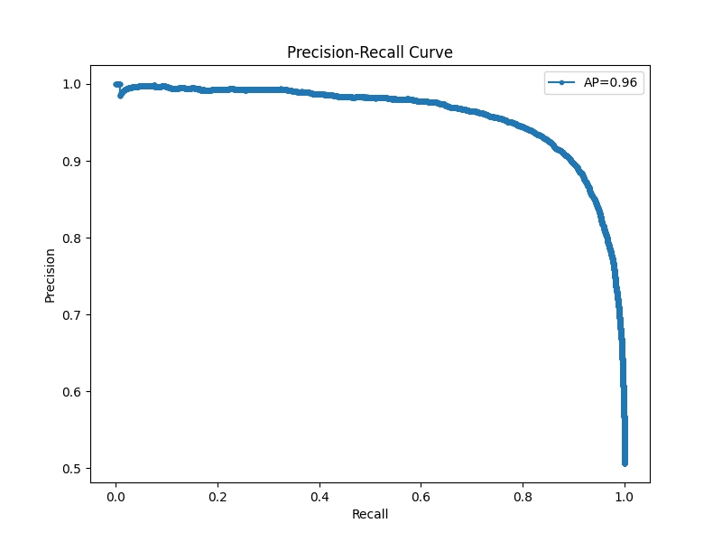
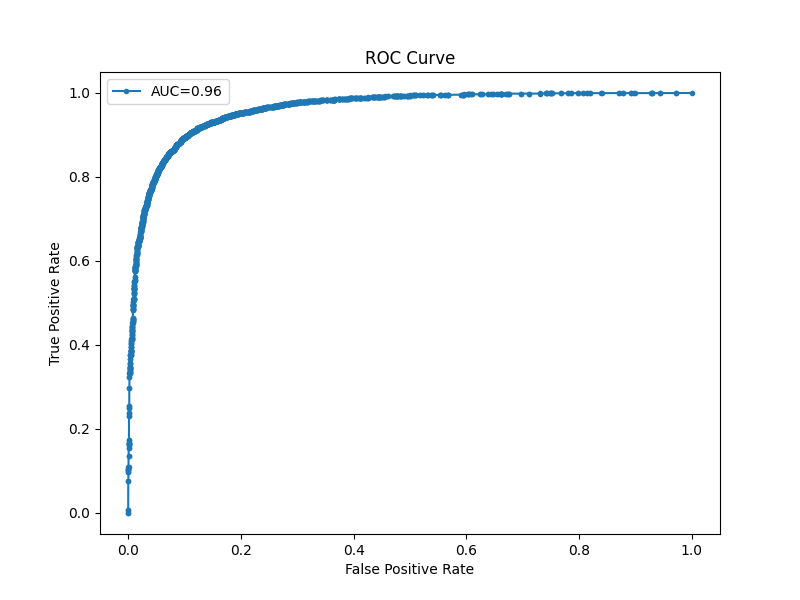

# Sentiment Analysis Project

## Overview

This project performs sentiment analysis on movie reviews from the IMDb dataset (<https://www.kaggle.com/datasets/lakshmi25npathi/imdb-dataset-of-50k-movie-reviews>). The goal is to classify the reviews as either "positive" or "negative" using a logistic regression model. The dataset is split into training and testing sets, with the model being trained on the training set and evaluated on the testing set. Various metrics and visualizations are used to assess the performance of the model.

## Dataset

The dataset used in this project consists of movie reviews and their corresponding sentiments (positive or negative). An example of the data is as follows:

review,sentiment
"One of the other reviewers has mentioned that after watching just 1 Oz episode you'll be hooked. They are right, as this is exactly what happened with me....",positive
"A wonderful little production. The filming technique is very unassuming- very old-time-BBC fashion and gives a comforting, and sometimes discomforting, sense of realism to the entire piece....",positive
"I thought this was a wonderful way to spend time on a too hot summer weekend, sitting in the air conditioned theater and watching a light-hearted comedy. The plot is simplistic, but the dialogue is witty and the characters are likable....",positive
"Basically there's a family where a little boy (Jake) thinks there's a zombie in his closet & his parents are fighting all the time....",negative

## Preprocessing

The text data is cleaned using the following steps:

1. Removing HTML tags.
2. Removing non-alphabetic characters.
3. Converting text to lowercase.
4. Removing stopwords.

## Model Training

The cleaned text data is converted to numerical data using TF-IDF (Term Frequency-Inverse Document Frequency) vectorization. A logistic regression model is then trained on the TF-IDF transformed training data.

## Evaluation

The model is evaluated on the test set using the following metrics:

- Precision
- Recall
- F1-score
- Accuracy

The classification report is as follows:

          precision    recall  f1-score   support
negative       0.90      0.89      0.89      7411
positive       0.89      0.91      0.90      7589
accuracy                           0.90     15000
macro avg      0.90      0.90      0.90     15000
weighted avg   0.90      0.90      0.90     15000

## Visualizations

Several visualizations are created to provide insights into the model's performance:

### Confusion Matrix

The confusion matrix shows the distribution of true vs. predicted labels. It helps to understand how many instances were correctly classified and where the model made mistakes.

### Precision-Recall Curve

The precision-recall curve shows the trade-off between precision and recall for different threshold values. The area under the precision-recall curve (average precision) provides a single measure of the model's performance.

### ROC Curve

The ROC (Receiver Operating Characteristic) curve shows the trade-off between the true positive rate (recall) and the false positive rate. The area under the ROC curve (AUC) is a single measure of the model's performance.

## How to Run the Project

1. Clone this repository.
2. Ensure you have Python and Anaconda installed.
3. Create and activate a virtual environment using Anaconda:

   conda create --name sentiment_analysis python=3.8
   conda activate sentiment_analysis

4. Install the required packages:

    pip install -r requirements.txt

5. Run the sentiment analysis script:

    python sentiment_analysis.py

### Conclusion

This project demonstrates a complete pipeline for sentiment analysis using logistic regression. The model achieves good accuracy and the visualizations provide insights into its performance. The confusion matrix, precision-recall curve, and ROC curve are useful tools for evaluating the effectiveness of the model.
